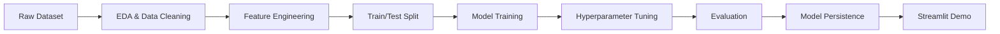

<div align="center">

# 🤖 Machine Learning Models

### End-to-End Classical ML Projects with Interactive Streamlit Demos

**From raw data to trained, evaluated, and deployed models using Python, scikit-learn, and Streamlit.**

[](https://www.python.org/)
[](https://scikit-learn.org/)
[](https://pandas.pydata.org/)
[](https://streamlit.io/)
[](LICENSE)

</div>

---

## 📌 Overview

This repository contains end-to-end machine learning projects that solve practical classification problems using classical ML techniques.

Each project follows a complete workflow:

```text
Raw Data → EDA & Cleaning → Feature Engineering → Model Training → Tuning & Evaluation → Saved Model → Streamlit Demo
```

The focus is not only on training models, but on building reproducible, interpretable, and deployable ML workflows.

---

## 🔗 Live Demos

| Project | Demo |
|---|---|
| 📉 Customer Churn Prediction | [customer-churn.streamlit.app](https://customer-churn-vhmvtn5oqq5sfqyjyijj2z.streamlit.app/) |
| 🤖 Machine Learning Models App | [machine-learning-model.streamlit.app](https://machine-learning-model-ipfxzaz7jrahcapvwxhifm.streamlit.app/) |

---

## 📦 Projects

| Project | Task | Goal | Folder |
|---|---|---|---|
| 📉 Customer Churn Prediction | Binary Classification | Predict whether a customer is likely to leave | `customer_churn/` |
| 🏠 NYC Airbnb Room Type Classification | Multi-Class Classification | Classify NYC Airbnb listings by room type | `NYC_Airbnb_Room/` |

---

## 📉 Customer Churn Prediction

Predicts whether a customer is likely to churn based on demographic, account, service, and billing-related features.

### Workflow

- Exploratory data analysis and missing-value handling
- Categorical encoding and feature preparation
- Train/test splitting with reproducible evaluation
- Classification model training
- Performance evaluation using accuracy, precision, recall, F1-score, and confusion matrix
- Model persistence with Joblib
- Interactive Streamlit prediction interface

### Business Value

Customer churn prediction helps teams identify at-risk customers earlier, prioritize retention efforts, and reduce avoidable revenue loss.

---

## 🏠 NYC Airbnb Room Type Classification

Classifies NYC Airbnb listings into room-type categories using listing characteristics and engineered features.

### Workflow

- Raw listing data exploration and cleaning
- Feature selection and preprocessing
- Categorical feature encoding
- Multi-class classification model training
- Model comparison across multiple algorithms
- Hyperparameter tuning with `RandomizedSearchCV`
- Evaluation and model persistence
- Streamlit-based interactive demo

### Models Compared

- Logistic Regression
- Decision Tree
- Random Forest
- Gradient Boosting

---

## ✨ What’s Covered

- **Classification** for both binary and multi-class problems
- **Exploratory data analysis** to understand distributions, correlations, and data-quality issues
- **Data cleaning and preprocessing** for real-world messy datasets
- **Feature engineering** to improve model input quality
- **Model comparison** across classical ML algorithms
- **Hyperparameter tuning** using `RandomizedSearchCV`
- **Model evaluation** using classification metrics and confusion matrices
- **Model persistence** using Joblib
- **Interactive deployment** using Streamlit Cloud

---

## 🧩 Tech Stack

| Layer | Tools |
|---|---|
| Language | Python |
| Machine learning | scikit-learn |
| Data handling | pandas, NumPy |
| Model persistence | Joblib |
| Interactive UI | Streamlit |
| Dependency management | `uv`, `pyproject.toml`, `uv.lock` |
| Alternative installation | `requirements.txt` |

---

## 📂 Project Structure

```text
machine-learning-model/
├── NYC_Airbnb_Room/       # NYC Airbnb room-type classification project
├── customer_churn/        # Customer churn prediction project
├── ui.py                  # Streamlit application
├── pyproject.toml         # Project dependencies and configuration
├── uv.lock                # Locked dependency versions
├── requirements.txt       # pip-compatible dependencies
└── .gitignore
```

Each project lives in its own folder with its own dataset, preprocessing code, model-training workflow, and saved artifacts.

---

## 🚀 Quick Start

### 1. Clone the repository

```bash
git clone [https://github.com/rj1230/machine-learning-model.git](https://github.com/rj1230/machine-learning-model.git)
cd machine-learning-model
```

### 2. Install dependencies

Using `uv`:

```bash
uv sync
```

Or using pip:

```bash
pip install -r requirements.txt
```

### 3. Launch the Streamlit app

```bash
streamlit run ui.py
```

---

## 🧪 ML Workflow



---

## 📊 Evaluation Approach

Models are evaluated using standard classification metrics:

- Accuracy
- Precision
- Recall
- F1-score
- Confusion matrix
- Class-wise performance

This avoids relying on accuracy alone, especially for imbalanced classification problems such as churn prediction.

---

## 🎯 Why This Repository Matters

These projects demonstrate the complete classical machine-learning workflow:

- Understanding a real-world business or data problem
- Preparing messy raw data for modeling
- Building and comparing multiple models
- Tuning models rather than relying on default parameters
- Evaluating results with appropriate metrics
- Saving trained artifacts for reuse
- Deploying an interactive interface for non-technical users

They form the practical ML foundation behind more advanced AI systems such as agentic RAG platforms, LLM routing systems, and production model services.

---

## 📄 License

This project is licensed under the MIT License.

---
- GitHub: [@rj1230](https://github.com/rj1230)
- Live Demo: [Machine Learning Models App](https://machine-learning-model-ipfxzaz7jrahcapvwxhifm.streamlit.app/)
